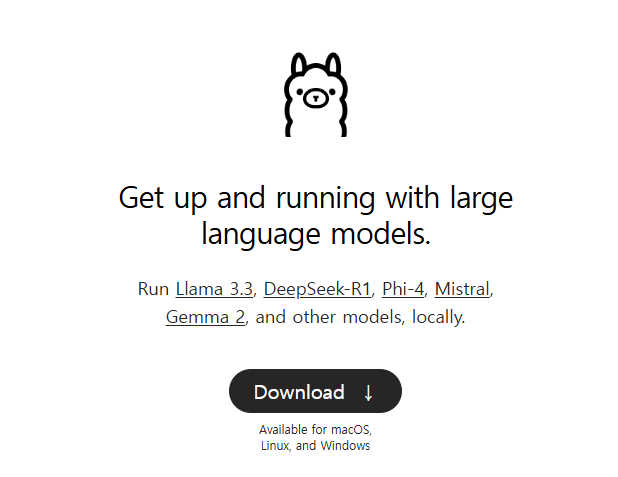
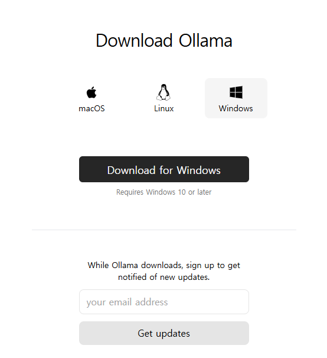
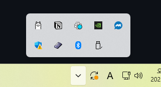
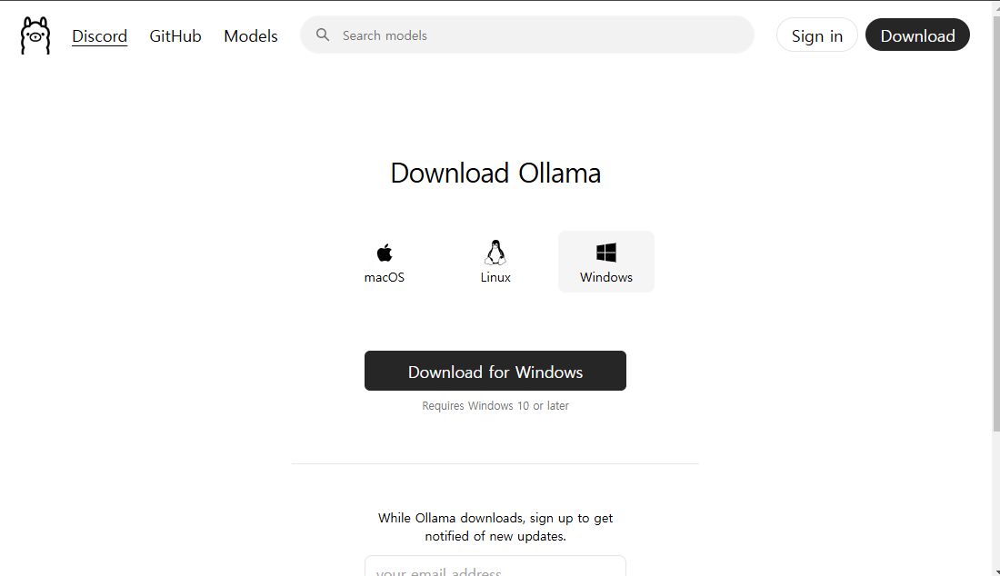
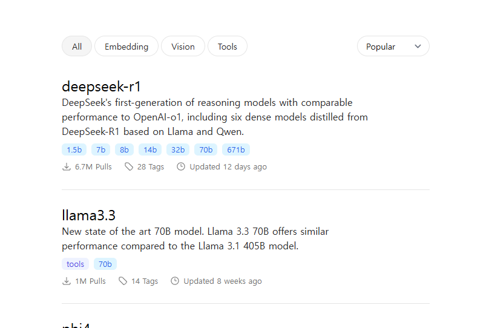
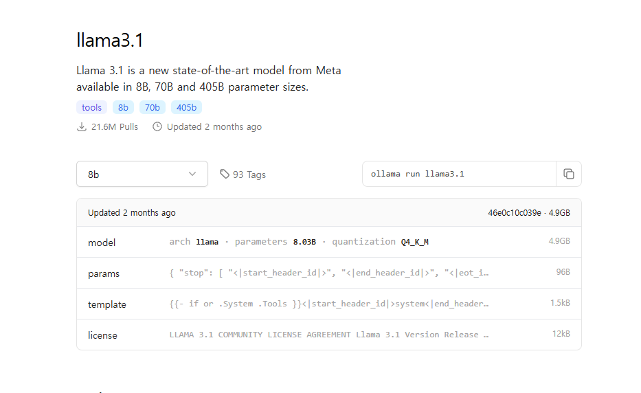
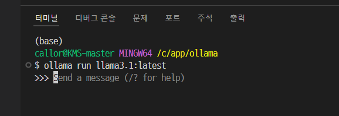
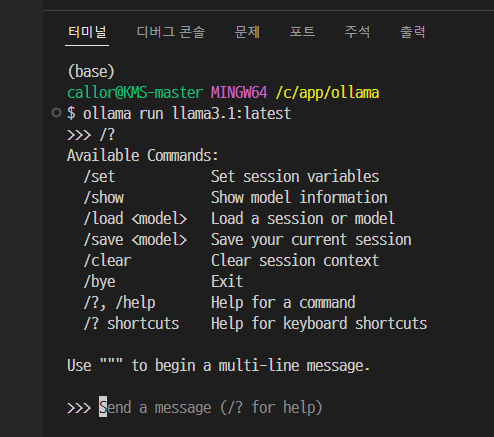
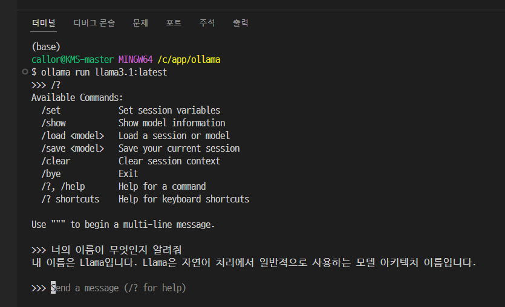

# Ollama로 라마 3.1 사용해 보기

Llama는 오픈소스로 열려있지만, 사용하기 위해 많은 용량이 필요하고 설치 방법이 복잡하여 많은 분들이 어려움을 겪으셨을 텐데요. 라마의 간편한 설치를 도와주는 오라마(Ollama)라는 사이트를 이용하여 Llama를 쉽게 사용해 보겠습니다.

## 설치법

오라마 사이트(https://ollama.com/)에 접속합니다.
하단의 다운로드 버튼을 클릭하여 오라마를 다운로드합니다.

자신의 운영체제에 맞는 버전으로 다운로드합니다.

다운로드한 파일을 실행하여 ollama demon을 설치한다

설치가 완료되면 백그라운드로 demon 이 실행된 것을 확인할 수 있다

이제 라마 3.1을 설치해 볼 차례인데요, 홈페이지 좌측 상단의 Models 버튼을 눌러준다

llama3.1을 찾아서 클릭한다. 현재, llama3.3 까지 출시되고, DeepSeek-R1 도 출시되어 있다.

일반 PC 에서 사용 및 테스트하기 적합한 용량의 버전이 `llama3.1 8B` 이므로 `llama3.1` 을 선택한다.
다음 화면에서 8b 가 선택된 것을 확인하고, 명령어를 클릭하여 복사한다

터미널에 접속하여 해당 명령어를 그대로 붙여넣기 한 후에 엔터를 누른다

기다리면 다음과 같이 라마가 자동 다운로드되고 설치된다. 시간은 5~10가량 소요되므로... 참고 기다리자

## 사용법

설치가 완료되면 다음과 같은 명령프롬프트가 나타난다

/? 를 입력하면 아래 이미지처럼 사용 가능한 명령어들을 알려주고, 모델 정보나 내용 지우기, 나가기 등을 실행할 수 있다

터미널 창에 질문을 입력하면 답변을 받을 수 있는다

라마 3.1은 오픈소스 LLM의 새로운 가능성을 열며, 폐쇄형 모델과 견줄만한 성능을 보여주고 있다. 특히, 405B와 같은 대규모 모델부터 개인 컴퓨터에서도 사용할 수 있는 8B 모델까지 다양한 선택지를 제공하며, 개발자들에게 강력한 도구로 자리 잡을 잠재력을 보여준다. 이를 통해 인공지능의 활용이 더욱 확장되고, 개발 환경에서 혁신적인 변화가 기대된다.
